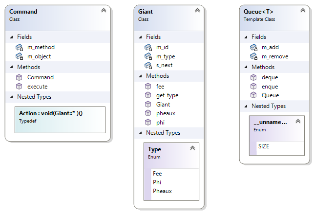

# Command Design Pattern Examples

Command Design Pattern Examples

## Class Diagrams

## References

* [Command in C++: before and after](https://sourcemaking.com/design_patterns/command/cpp/1)
* [Command in C++](https://sourcemaking.com/design_patterns/command/cpp/2)
* [Command in C++: simple and macro command](https://sourcemaking.com/design_patterns/command/cpp/3)
