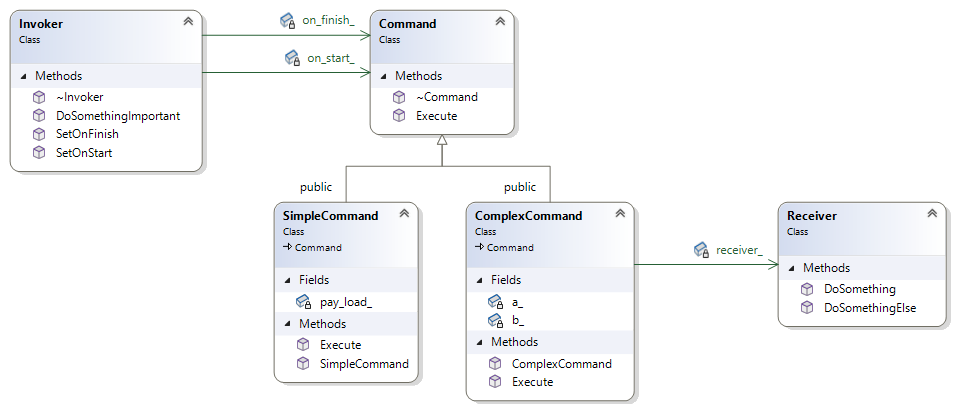

# Command Design Pattern Example

Command Design Pattern Example

## Class Diagrams

## References

* [https://refactoring.guru/design-patterns/command/cpp/example](https://refactoring.guru/design-patterns/command/cpp/example)
